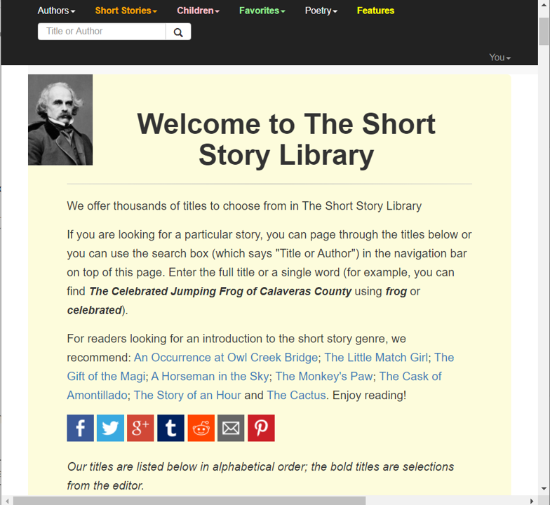

# american_literature
- crawl, processing code
- https://americanliterature.com/short-746story-library,

## quickstart
> to be written

## crawling
- python <code>request</code>, <code>beautifulsoup4</code>
- asked permission for use (via the twitter, one and only mean of contact), did not responded.
- crawling code waits 1 seconds after scraping one story to avoid unintended server breakdown.

## post processing
### sentencizing 
- We used <code>spaCy</code> to do this.
- takes ~1 day, 1.148 million sentences. (train/val/test = 8:1:1)
- We connected the consecutive sentence one by one to make the sentence to sentence prediction form of the dataset
- avoided connecting end of a story with start of another story. 
### filtering out
- filtered out too short (<= 3 tokens), or too long (>= 70 tokens) sentences
- resulted in 11.98\% of outliers to be excluded (train/val/test = 11.99\%, 11.99\%, 11.90\%)

## specs
train = 808.34 k sentences     
val = 10.11 k sentences      
test = 10.11 k sentences 
